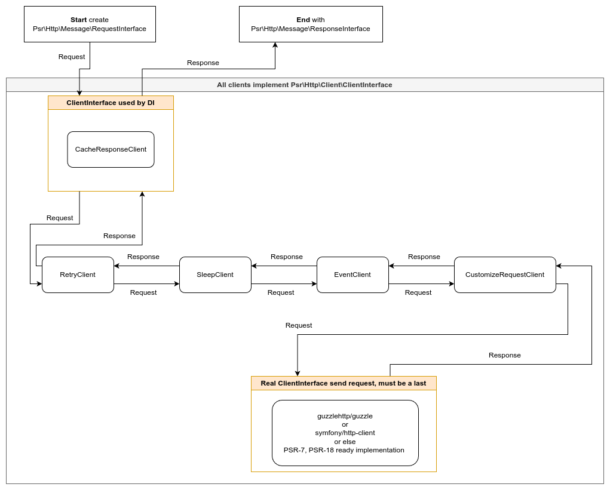

# HTTP Clients

The HTTP Clients package provides a collection of HTTP clients that can be used to manage HTTP requests and responses in your PHP application. The package includes a ClientsFactory to simplify the creation of clients by allowing you to define a list of ClientFactoryContract implementations. 

## Features

- Uses PSR container for dependency injection.
- **[CacheResponseClient](#cacheresponseclient-file)**: Utilizes PSR-6 (simple-cache) for caching responses, improving development speed by serving cached responses for subsequent requests.
- **[CustomizeRequestClient](#customizerequestclient-file)**: You can modify the request before sending it.
- **[EventClient](#eventclient-file)**: Dependent on PSR-14 (event-dispatcher) and enables you to attach events before, during, or after a request, which is useful for logging or other actions.
- **[RetryClient](#retryclient-file)**: If the call sendRequest throw exception, it tries to send request once more.
- **[SleepClient](#sleepclient-file)**: Allows you to introduce a wait interval between requests, which may be necessary for interacting with external APIs that require rate limiting.
- **[StoreClient](#storeclient-file)**: Save your **REQ**uests as PHPStorm `REQ.http` file and corresponding **RES**ponse as a file with suffix `RES.<code>.[headers|xml|txt|json|html|pdf]`.

## Installation

You can install the HTTP Clients package via Composer:

```sh
composer require strictphp/http-clients
```

## Usage

The ClientsFactory simplifies the creation of clients by allowing you to define a list of ClientFactoryContract implementations with dependency injection. 

Example:
```php
use Psr\Container\ContainerInterface;
use Psr\Http\Client\ClientInterface;
use StrictPhp\HttpClients\Clients\CacheResponse\CacheResponseClientFactory;
use StrictPhp\HttpClients\Clients\CustomizeRequest\CustomizeRequestClientFactory;
use StrictPhp\HttpClients\Clients\Event\EventClientFactory;
use StrictPhp\HttpClients\Clients\Retry\RetryClientFactory;
use StrictPhp\HttpClients\Clients\Sleep\SleepClientFactory;
use Strictphp\HttpClients\Factories\ClientsFactory;
use Strictphp\HttpClients\Iterators\FactoryToServiceIterator;

// Assuming $client is the main client like GuzzleHttp\Client
/** @var ClientInterface $client */
/** @var ContainerInterface $container */

// the order of classes is important, see image below
$clients = [
    CacheResponseClientFactory::class, // used like first
    RetryClientFactory::class,
    SleepClientFactory::class,
    EventClientFactory::class,
    CustomizeRequestClientFactory::class,
    // Other client factories...
];

/**
 * This iterator change array<class-string<ClientFactoryContract>> to array<ClientFactoryContract>
 */
$toService = new FactoryToServiceIterator($container, $clients);

$clientFactory = new ClientsFactory($client);
$client = $clientFactory->create($toService);
// Alternatively, you can use second parameter of constructor:
$clientFactory = new ClientsFactory($client, $toService);
$client = $clientFactory->create();
```

These examples demonstrate how to efficiently manage HTTP requests and responses in your PHP application using the provided HTTP client classes and the ClientsFactory.



## ConfigManager

Config manager is designed for setting different configuration per host (IP, domain). Each HTTP client can contain `Config` class in their namespace. 

**Setting up default configuration**

```php
use StrictPhp\HttpClients\Managers\ConfigManager;
use StrictPhp\HttpClients\Clients\Sleep;

// set up for SleepClient
$config = new Sleep\SleepConfig(1000, 2000);

/** @var ConfigManager $configManager */
$configManager->addDefault($config);
```

**Setting up override for given domain**

```php
use StrictPhp\HttpClients\Managers\ConfigManager;
use StrictPhp\HttpClients\Clients\Sleep;

// set up for SleepClient
$config = new Sleep\SleepConfig(1000, 2000);

/** @var ConfigManager $configManager */
$configManager->add('strictphp.com', $config);
```

**You should set your DI container to provide ConfigManager as a singleton.**

## Clients

- Each client can be built using its own Factory class (in their namespace). Factory uses a DI container that should resolve: ClientInterface for HTTP/s communication and ConfigManaer
- Each client can be configured by ConfigManager.

### CacheResponseClient ([file](src/Clients/CacheResponse/CacheResponseClient.php))

The CacheResponseClient utilizes PSR-6 (simple-cache) for caching responses, improving development speed by serving cached responses for subsequent requests. Here are some benefits and considerations:

- **Development Efficiency**: Speeds up development by caching responses, reducing the need for repeated API calls during development.
- **Local Testing**: Enable the `saveOnly` option in production to cache responses and download them for testing on localhost, ensuring consistency and performance.
- **Customization**: Customize cache key preparation by implementing your own contract in [CacheKeyMakerAction.php](src/Actions/CacheKeyMakerAction.php).

### CustomResponseClient ([file](src/Clients/CustomResponse/CustomResponseClient.php))

> Subject to change.

You can define custom response file.

The #1 parameter in constructor can be:

- a path on serialized [SerializableResponse](src/Responses/SerializableResponse.php) which created by [SaveResponse.php](src/Responses/SaveResponse.php), file with extension `shttp` it's mean `serialized http`
- a path on file with plain text, this is used like body only

You need to set up container dependency to add the content you need.

### CustomizeRequestClient ([file](src/Clients/CustomizeRequest/CustomizeRequestClient.php))

Alter request before sending it to the HTTPClient.
You can throw ClientExceptionInterface. This client could be useful for testing error handling mechanisms in your application and use cached *.shttp file.

```php
use Psr\Http\Message\RequestInterface;
use StrictPhp\HttpClients\Clients\CustomizeRequest\CustomizeRequestConfig;
use StrictPhp\HttpClients\Managers\ConfigManager;

/** @var ConfigManager $configManager */
$configManager->add('www.example.com', new CustomizeRequestConfig(function(RequestInterface $request): RequestInterface {
    return $request->withHeader('uuid', generate_uuid());
}));
```

### EventClient ([file](src/Clients/Event/EventClient.php))

> dependent on PSR-14 (event-dispatcher)

You can attach events before, failed or request success. It is useful for logging.

- save http file for PHPStorm [SaveForPhpstormRequest.php](src/Requests/SaveForPhpstormRequest.php)
- save response [SaveResponse.php](src/Responses/SaveResponse.php)

### RetryClient ([file](src/Clients/Retry/RetryClient.php))

Retry client is designed to retry failed request with ability to define number of tries and allowlist (based on exception).

### SleepClient ([file](src/Clients/Sleep/SleepClient.php))

The SleepClient allows you to introduce a wait interval between requests, which may be necessary for interacting with external APIs that require rate limiting.

### StoreClient ([file](src/Clients/Store/StoreClient.php))

The StoreClient saves request and response, without dependency on PSR-14

- save http file for PHPStorm [SaveForPhpstormRequest.php](src/Requests/SaveForPhpstormRequest.php)
- save response [SaveResponse.php](src/Responses/SaveResponse.php)

# Write your own client

You can write your own client simply by implementing these interfaces:

- Client must implement `Psr\Http\Client\ClientInterface`. 
- Config must implement `StrictPhp\HttpClients\Contracts\ConfigInteface`
- Factory for client implement `StrictPhp\HttpClients\Contracts\ClientFactoryContract`

Below is an example of an implementation:

## Testing

You can save file with extension *.shttp by [SaveResponse](src/Responses/SaveResponse.php) or use our PSR16 implementation [CachePsr16Service](src/Services/CachePsr16Service.php). This file you can to use in tests by [CustomResponseClient](src/Clients/CustomResponse/CustomResponseClient.php).

```php
use StrictPhp\HttpClients\Clients\CustomResponse\CustomResponseClient;
/** @var \Psr\Http\Message\RequestInterface $request */
$client = new CustomResponseClient(__DIR__ . '/dir/filename.shttp');
$response = $client->sendRequest($request);

$response instanceof \Psr\Http\Message\ResponseInterface;
```

## Config

```php
namespace My;

use StrictPhp\HttpClients\Contracts\ConfigInterface;
use Psr\Http\Message\RequestInterface;
use Psr\Http\Message\ResponseInterface;
use StrictPhp\HttpClients\Entities\AbstractConfig;

/**
 * parameters of constructor must have to filled default values  
 */
class Config extends AbstractConfig 
{
    public function __construct(
        private readonly int $optionA = 1,
        private readonly int int $optionB = 2,
    ) {
    }    

    public function initFromDefaultConfig(ConfigInterface $object): void 
    {
        // if you want to pass an object reference from the default configuration
        /** @see \StrictPhp\HttpClients\Clients\CacheResponse\CacheResponseConfig */
        
        // or empty
        /** @see \StrictPhp\HttpClients\Clients\Sleep\SleepConfig */
    }
    
}
```

## Client


```php
namespace My;

use Psr\Http\Client\ClientInterface;
use Psr\Http\Message\RequestInterface;
use Psr\Http\Message\ResponseInterface;
use StrictPhp\HttpClients\Managers\ConfigManager;
use My\Config;

class MyClient implements ClientInterface 
{
    public function __construct(
        private ClientInterface $client,
        private ConfigManager $configManager,
    ) {
    }    


    public function sendRequest(RequestInterface $request): ResponseInterface
    {
        $host = $request->getUri()->getHost();
        $config = $this->configManager->get(Config::class, $host);
        $config->optionA;
        $config->optionB;
        
        // do anything
        $response = $this->client->sendRequest($request)
        // do anything
        
        return $response;
    }
    
}
```

## ClientFactory

```php
namespace My;

use StrictPhp\HttpClients\Contracts\ClientFactoryContract;
use Psr\Http\Client\ClientInterface;
use Psr\Http\Message\RequestInterface;
use Psr\Http\Message\ResponseInterface;
use My\Config;

class ClientFactory implements ClientFactoryContract 
{
    public function __construct(
        private ConfigManager $configManager,
    ) {
    } 
    
    public function create(ClientInterface $client): ClientInterface
    {
        return new MyClient($client, $this->configManager);
    }
    
}
```
