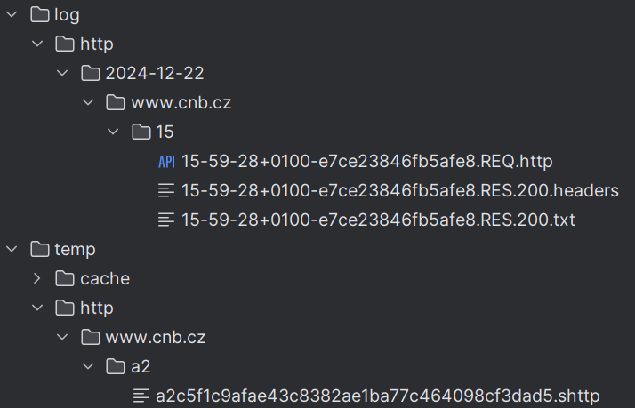

# Http pro Nette

Máte oblíbeného http klienta implementujícího PSR-18 (guzzlehttp/guzzle, symfony/http-client, atd...). Nástroj vám vnese světlo do odchozí komunikace, umožní logovat requesty, opakovat requesty, dát časovou mezeru mezi requesty na stejného hosta, kešovat requesty pro vývoj a debugovat v podobě generovaných souborů pro phpstrom, které sputíte přes IDE. Konfigurace lze dělat pro všechny hosty nebo jednotlivě zvlášť, podle potřeb serveru se kterým komunikujeme.

## Jak to funguje

V principu se jedná o balík tříd implementující PSR-18 a každá implementace je vrstva pro middleware. [Seznam klientů](https://github.com/strictphp/http-clients?tab=readme-ov-file#features) je také v originálním návodu.

```sh
composer require strictphp/http-clients
```

Pokud nemáte žádného http klienta, stačí nainstalovat.

```sh
composer require guzzlehttp/guzzle
```

### NEON konfigurace

Klasika, je potřeba registrovat rozšíření.

```neon
extensions:
	psrHttp: StrictPhp\HttpClients\Nette\DI\HttpClientsExtension(%tempDir%/http, %logDir%/http)
```

Pokud máme v projektu `guzzlehttp/guzzle` nebo `symfony/http-client`, rozšíření si ho najde a automaticky připojí. 
Máme-li jinou implementaci PSR-18 nebo bude potřeba změnit výchozí parametry klienta, je potřeba upravit.
V přikladu jsme zvolili guzzle.

```neon
services:
    psrHttp.main.client: GuzzleHttp\Client([timeout: 5.0]) # automaticky nastaveno autowire: false
```

V tuto chvíli nám v aplikaci funguje DI na interface `Psr\Http\Client\ClientInterface`, jako třídu dostaneme `StrictPhp\HttpClients\Clients\MainHttp\MainHttpClient`. Třída `MainHttpClient` je vstupní pro všechny middlewares, takže si do ni můžete dát breakpoint a z ní začít krokovat. Nyní nevyužíváme žádných východ, které poskytuje knihovna.

Takže si zapneme middlwares, které potřebujeme. Na pořadí záleží, je jen na nás, které si povolíme. 

```neon
services:
	psrHttp.middlewares:
		arguments:
			-
				- @psrHttp.middleware.cacheResponse
				- @psrHttp.middleware.retry
				- @psrHttp.middleware.sleep
				- @psrHttp.middleware.store
				- @psrHttp.middleware.customizeRequest
				
				# debug
				# - @psrHttp.middleware.customResponse
				
				# pouze pokud máte další knihovnu implementující PSR-14 (EventDispatcherInterface)
				# - @psrHttp.middleware.event 
```

Už jenom chybí si ukázat jak si nakonfigurujeme requesty na hosty. Každý middleware má k sobě konfigurační třídu, na příklad CacheResponseClient má CacheResponseConfig.

```neon
services:
	psrHttp.config.manager:
		setup:
			# pro všechny hosty
			- addDefault(StrictPhp\HttpClients\Clients\CacheResponse\CacheResponseConfig(604000, saveOnly: true))
			- addDefault(StrictPhp\HttpClients\Clients\Store\StoreConfig(serialized: false, onSuccess: false))
			# konfigurace podle hosta
			- add('www.cnb.cz', [
				StrictPhp\HttpClients\Clients\CacheResponse\CacheResponseConfig(60, saveOnly: false),
				StrictPhp\HttpClients\Clients\Store\StoreConfig(serialized: false, onSuccess: true), # uloží do keše každý request
			])
```

## Vlastní middleware

Jak si napsat vlastní middleware je popsáno v [originálním návodu](https://github.com/strictphp/http-clients?tab=readme-ov-file#write-your-own-client). Pro Nette není potřeba implementovat `StrictPhp\HttpClients\Contracts\ClientFactoryContract`. Nette si tuto třídu umí vygenerovat samo. 

```neon
services:
	my.middleware:
		implement: StrictPhp\HttpClients\Contracts\ClientFactoryContract
		type: MyMiddleWareClient
		autowired: false
		
	psrHttp.middlewares:
		arguments:
			-
			    - @my.middleware
```

## Popis CacheResponseClient

Soubory v logu jsou podle `<datum>/<host>/<hodina>/<název souboru>`. V temp je jen kěš, kdy je nastaveno pouze `saveOnly: true`, do keše jen zapisuje, keš je možné přenášet mezi stroji.



Ukázka vygenerovaného souboru pro PhpStorm viz *.REQ.psrHttp.

```http
### Duration: 0.22270321846008
GET https://www.cnb.cz/cs/financni_trhy/devizovy_trh/kurzy_devizoveho_trhu/denni_kurz.txt
Host: www.cnb.cz
```

## Závěr

Celý funkční příklad je zde v repozitáři v adresáři [src/Nette/Example](Example). Stačí spustit  `php src/Nette/Example/index.php`.
